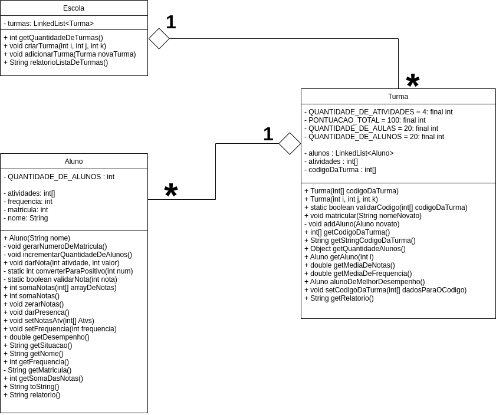

# EX04  - Escola de Idiomas
### Gabriel Victor Couto Martins de Paula
> - Engenharia de Software
> - Laboratório de Programação Modular


## Diagrama


## Metodos e Atributos das classes
### classe Aluno

```java
public class Aluno {
    private static int QUANTIDADE_DE_ALUNOS = 0;
    private int[] atividades;
    private int frequencia;
    private int matricula;
    private String nome;
    /*==========*/
    public Aluno(String nome)
    private void gerarNumeroDeMatricula()
    private void incrementarQuantidadeDeAlunos()
    public void darNota(int ativdade, int valor)
    private static int converterParaPositivo(int num)
    private static boolean validarNota(int nota)
    public int somaNotas(int[] arrayDeNotas)
    public int somaNotas()
    public void zerarNotas()
    public void darPresenca()
    public void setNotasAtv(int[] Atvs)
    public void setFrequencia(int frequencia)
    public double getDesempenho()
    public String getSituacao()
    public String getNome()
    public int getFrequencia()
    private String getMatricula()
    public int getSomaDasNotas()
    public String toString()
    public String relatorio()
}
```

### classe Turma 
```java
    public static final int QUANTIDADE_DE_ATIVIDADES = 4;
    public static final int PONTUACAO_TOTAL = 100;
    public static final int QUANTIDADE_DE_AULAS = 20;
    public static final int QUANTIDADE_DE_ALUNOS = 20;

    private LinkedList<Aluno> alunos = new LinkedList<>();
    private int[] atividades;
    private int[] codigoDaTurma;

    public Turma(int[] codigoDaTurma)
    public Turma(int i, int j, int k)
    public static boolean validarCodigo(int[] codigoDaTurma)
    public void matricular(String nomeNovato)
    private void addAluno(Aluno novato)
    public int[] getCodigoDaTurma()
    public String getStringCodigoDaTurma()
    public Object getQuantidadeAlunos()
    public Aluno getAluno(int i)
    public double getMediaDeNotas()
    public double getMediaDeFrequencia()
    public Aluno alunoDeMelhorDesempenho()
    public void setCodigoDaTurma(int[] dadosParaOCodigo)
    public String getRelatorio()
```

### classe Escola
```java
    private LinkedList<Turma> turmas = new LinkedList<>();

    public int getQuantidadeDeTurmas()
    public void criarTurma(int i, int j, int k)
    public void adicionarTurma(Turma novaTurma)
    public String relatorioListaDeTurmas()

```

