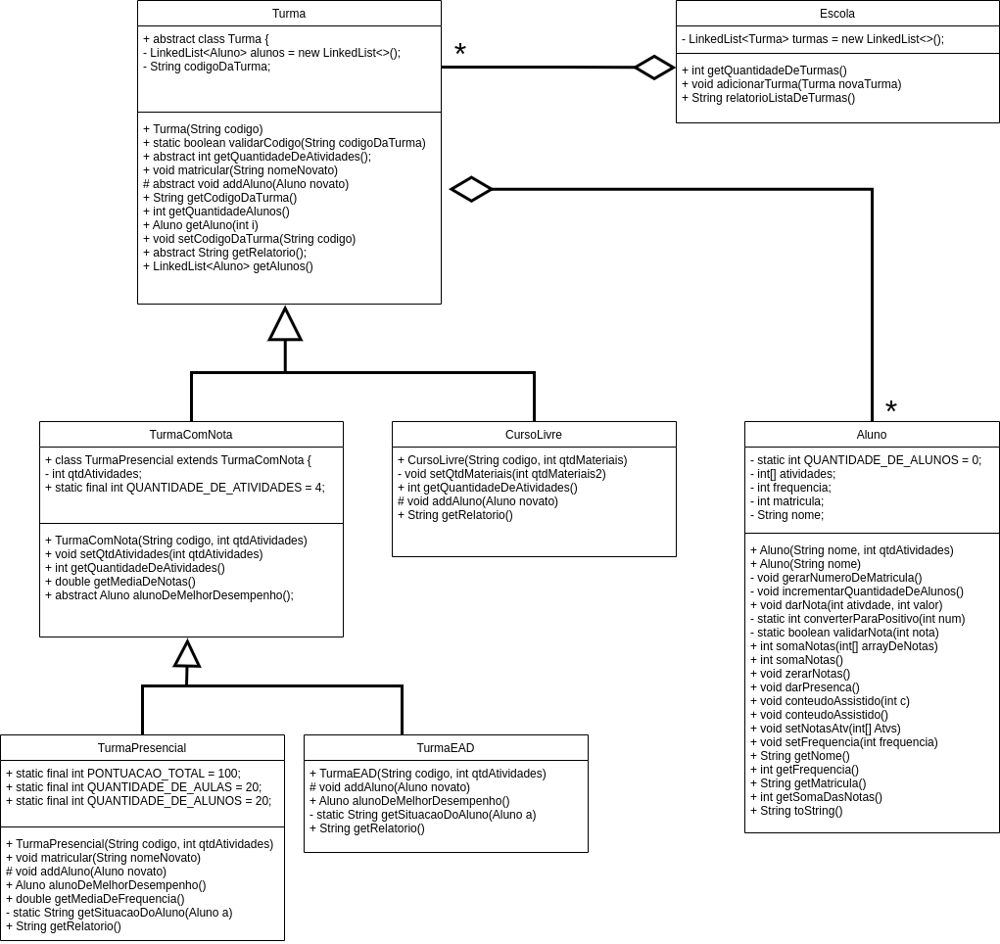

# EX05  - Escola de Idiomas
### Gabriel Victor Couto Martins de Paula
> - Engenharia de Software
> - Laboratório de Programação Modular


## Diagrama


## Metodos e Atributos das classes
### classe Aluno

```java
public class Aluno {
    private static int QUANTIDADE_DE_ALUNOS = 0;
    private int[] atividades;
    private int frequencia;
    private int matricula;
    private String nome;
   
    public Aluno(String nome, int qtdAtividades)
    public Aluno(String nome)
    private void gerarNumeroDeMatricula()
    private void incrementarQuantidadeDeAlunos()
    public void darNota(int ativdade, int valor)
    private static int converterParaPositivo(int num)
    private static boolean validarNota(int nota)
    public int somaNotas(int[] arrayDeNotas)
    public int somaNotas()
    public void zerarNotas()
    public void darPresenca()
    public void conteudoAssistido(int c)
    public void conteudoAssistido()
    public void setNotasAtv(int[] Atvs)
    public void setFrequencia(int frequencia)
    public String getNome()
    public int getFrequencia()
    public String getMatricula()
    public int getSomaDasNotas()
    public String toString()
}
```

### classe Turma 
```java
public abstract class Turma {
    private LinkedList<Aluno> alunos = new LinkedList<>();
    private String codigoDaTurma;

    public Turma(String codigo)
    public static boolean validarCodigo(String codigoDaTurma)
    public abstract int getQuantidadeDeAtividades();
    public void matricular(String nomeNovato)
    protected abstract void addAluno(Aluno novato)
    public String getCodigoDaTurma()
    public int getQuantidadeAlunos()
    public Aluno getAluno(int i)
    public void setCodigoDaTurma(String codigo)
    public abstract String getRelatorio(); 
    public LinkedList<Aluno> getAlunos()
}
```

### classe TurmaComNota
```java
public class TurmaPresencial extends TurmaComNota {
     private int qtdAtividades;
    public static final int QUANTIDADE_DE_ATIVIDADES = 4;

    public TurmaComNota(String codigo, int qtdAtividades)
    public void setQtdAtividades(int qtdAtividades)
    public int getQuantidadeDeAtividades()
    public double getMediaDeNotas()
    public abstract Aluno alunoDeMelhorDesempenho();
}
```

### classe TurmaPresencial 
```java
public class TurmaPresencial extends TurmaComNota {
    public static final int PONTUACAO_TOTAL = 100;
    public static final int QUANTIDADE_DE_AULAS = 20;
    public static final int QUANTIDADE_DE_ALUNOS = 20;

    public TurmaPresencial(String codigo, int qtdAtividades)
    public void matricular(String nomeNovato)
    protected void addAluno(Aluno novato)
    public Aluno alunoDeMelhorDesempenho()
    public double getMediaDeFrequencia()
    private static String getSituacaoDoAluno(Aluno a)
    public String getRelatorio()
}
```

### classe TurmaEAD 
```java
public class TurmaEAD extends TurmaComNota  {
    public TurmaEAD(String codigo, int qtdAtividades)
    protected void addAluno(Aluno novato)
    public Aluno alunoDeMelhorDesempenho()
    private static String getSituacaoDoAluno(Aluno a)
    public String getRelatorio()
}
```

### classe CursoLivre 
```java
public class CursoLivre extends Turma  {

    public CursoLivre(String codigo, int qtdMateriais)
    private void setQtdMateriais(int qtdMateriais2)
    public int getQuantidadeDeAtividades()
    protected void addAluno(Aluno novato)
    public String getRelatorio()
}
```


### classe Escola
```java
public class Escola {
    private LinkedList<Turma> turmas = new LinkedList<>();

    public int getQuantidadeDeTurmas()
    public void adicionarTurma(Turma novaTurma)
    public String relatorioListaDeTurmas()
}

```

